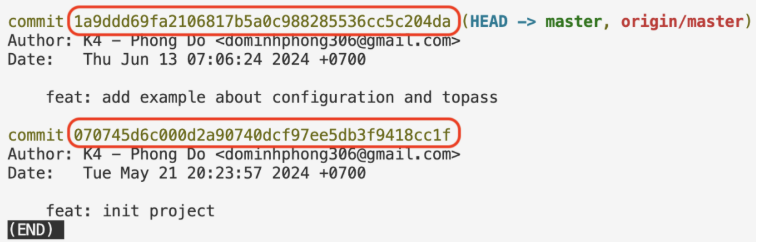

# GIT
**1. Undo**
- Committed message:
    `git commit --amend -m"message"`
- Move a file/all files from staging area back to working directory  
    `git restored  --staged <filename>`  
    `git restored  --staged .`
- Move a file/all files from repository back to working directory (un-commit)  
    `git reset HEAD~N`  
    N = number of committed  
**Note:** The 1st committed cannot be reset. Only can delete folder .git then add again if needed.

**2. Branching**  
Git uses branches to create separate “versions” of code, avoiding affecting the “original”.  
When initializing a repo (git init), a default branch will be created.  
`git config --global init.defaultBranch main`  
=> configuration: when initializing, set the default branch to main branch
- Pull code from server:  
    `git pull origin main`  
    **Note:** Always pull code before create new branch
- Show the branch list:  
    `git branch`  
    Note: At least 1 commit is required to show the branch list.
- Create new branch:  
    `git branch <branch_name>`
- Move to another branch:  
    `git checkout <branch_name>`
- Create and move to new branch:  
    `git checkout -b <branch_name>`
- Delete branch:  
    `git branch -D <branch_name>`  
- When using the `git log`, we see the list of commits as follows:

In which, the part circled in red in the picture is called commit hash or revision. To return to revision (or simply understand it as going back to the past to see what your code was like at that time), we use `git checkout <revision>`  
eg.  
`git checkout 070745d6c000d2a90740dcf97ee5db3f9418cc1f`

**3. .GitIgnore**  
To ignore files that do not need to be tracked by git.
- Ignore file: `<file_name>`
- Ignore folder: `<folder-name>/`
# Javascript
**1. Convention name**
- `snake_case`: dont use
- `kebab-case`: for file
- `camelCase`: for variable, property, function
- `PascalCase`: for class

**2. Console.log**  
```
console.log(‘String’);  
console.log(“String”);  

let variableName = “String”;

console.log(`${variableName}`);  
console.log(`String ${variableName}`);  
console.log(“Toi ten la” + variableName+ “”);
```
**3. Object**  
To store a set of values ​​in the same variable or constant  
```
let/const <object_name> = {
<property>: <value>,
...
}
```
In which:
- `<property>`: same as naming rules variable
- `<value>`: has the same type as variable, or is another object.  

eg.
```  
let user = {“name”: “Alex”, “age”: 10, “email”: “alex@gmail.com”}
const product = {
    name: “Laptop”,
    price: 500,
    isWindow: true,
    manufacturer: {
    name: “Acer”,
    year: 2024
    }
}
```
To use object:
```
console.log("name = " + user.name);
console.log("manufacturer name = " + product.manufacturer.name);
console.log(“price = “, product[“price”]);
```
eg.
```
let student = {
    name: "Thao",
    role: "student",
    class: {
        className: "K18",
        subject: "Fullstack Automation"
    }
}
console.log(student.name);
console.log(student.class.className);
console.log(student["role"]);
console.log(student["class"] ["subject"]);
```
Re-assign:
```
user.age = 28;
product[“manufacturer”][“year”] = 2025;
```
As we know, when using const (constant), the value cannot be changed.  
Eg.
```
const a = 10;
a = 15; // error
```
Same for objects, if you replace the whole object with a new one, you will also get an error.  
Eg.
```
const student = {“name”: “alex”, “age”: 20}
student = {“name”: “Nagi”, “age”: 18} // error
```
However, if you only change the properties of the object, it is perfectly valid. For example, change the value of name in the student object:
```
const student = {“name”: “alex”, “age”: 20}
student.name = “Nagi”; // valid
```
To add a new property to an object, we just need to use . or square brackets [] to define the new property.
```
let bike = {
    make: 'Yamaha',
    model: 'YZF-R3'
};

bike.color = “Blue”;
bike[“price new”] = 100;

console.log(bike);
```
Result:  
`{make: 'Yamaha', model: 'YZF-R3', color: 'Blue', ‘price new’ : 100}`

To delete an object's properties, we use the delete function:
```
let employee = {
    name: 'Le Van C',
    age: 30,
    department: 'HR'
};

delete employee.age;
console.log(employee);
```
Result:  
`{name: 'Le Van C', department: 'HR'}`

**4. Array**
- Create array
    - Declare
    - Use
- Access array
    - Array length: length
    - Get element by index: [0], [1], [2],...
eg.
```
const arr = ["Thao", "Phuong", "Hien", "Hieu", "Uyen", 89, true];

console.log("Do dai la", arr.length);
console.log("Ten la", arr[0]);
```
To add more element into array, use `push()`
```
const arr = [1,2];
arr.push(3);

console.log(arr);
// Result
[1, 2, 3]
```
**5. Function**  
Is a named and reusable piece of code that performs a specific task or calculation.
- Declare
```
function <nameFunction>() {
// code
}
```
- Parameter
- Return value
eg.
```
function helloWorld () {
    console.log("Hello World!");
}

helloWorld();
```
```
function getMax(a,b) {

    if (a > b){
        return a;
    } else {
        return b;
        }
}

maxNumber = getMax(5,10); 
console.log(maxNumber);
```